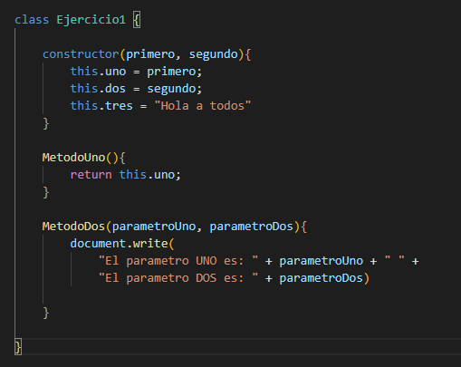
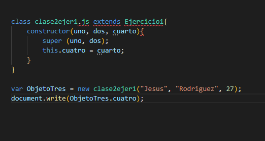
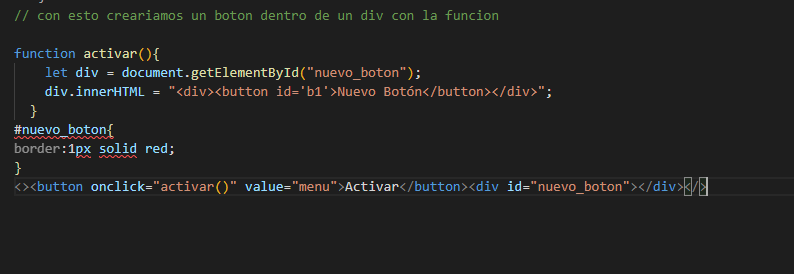

--------ANALISIS--------

OBJETO: entidad existente en la memoria del ordenador que tiene unas propiedades (atributos o datos sobre sí mismo almacenados por el objeto) y unas operaciones disponibles específicas (métodos).

CLASES: Las clases son la base de la Programación Orientada a Objetos. Una clase es una plantilla que define la forma de un objeto; en ella se agrupan datos y métodos que operarán sobre esos datos.

INSTANCIAS: una referencia de una clase hacia otra con lo cual permite a ambas clases ínteractuar entre si

------Prueba------

